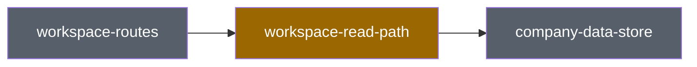

# Visual recap

Produce a high-altitude review aid directly in the PR description. Render the
canonical diagram with GitHub Mermaid and store the recap between the exact
HTML markers below. Treat it as a supplement to normal review, never a
replacement for reading the diff.

This CashLift adaptation is based on Kent C. Dodds's `visual-recap` skill. For
CashLift PRs, use this repository-local GitHub variant. Use the separately
installed hosted Agent-Native Plan variant only when the user explicitly asks
for a hosted or interactive recap.

## Modes

- **Plan:** Describe intended impact against the current system before or while
  implementing. Put the block in the plan or response until a PR exists.
- **Recap:** Describe what the pushed PR diff actually does. Replace the plan
  block and record meaningful plan drift.

## Establish facts

1. Read `docs/contributing/architecture/primitives.yaml`.
2. In recap mode, resolve the PR base with
   `gh pr view <number> --json baseRefName,headRefName`.
3. Read `git diff <base>...HEAD --stat` and the full diff. Do not classify from
   conversation or memory.
4. Cross-check module ownership against `.fallowrc.json`.
5. Map every changed path to one or more primitives through `code`. Use the
   most specific match first. Report genuinely unmapped paths instead of
   silently omitting them.
6. Update the primitive map in the same PR when a primitive or invariant is
   added, removed, or materially reshaped.

Every recap claim must cite an exact changed path in the evidence column.

## Classify impact and review risk independently

Classify the structural impact for each touched primitive:

| Impact | Meaning |
| --- | --- |
| `composes` | Uses existing behavior and contracts; changes wiring or call sites |
| `extends` | Changes existing behavior, shape, contract, ownership, or invariant |
| `adds` | Introduces a new system primitive and updates the primitive map |

Roll the overall impact up as `adds` > `extends` > `composes`.

Then classify review risk from what can fail:

| Risk | Triggers |
| --- | --- |
| High | Authentication, authorization, company isolation/RLS, financial writes, secrets/PII, destructive behavior, or public/private boundaries |
| Medium | API/schema/data-shape changes, cross-module dependencies, shared UI contracts, mutations, browser-time decisions, platform configuration, or observability contracts |
| Low | Documentation, tests, or wiring that does not touch an invariant or runtime contract |

Use the highest applicable trigger. Do not infer risk from impact alone: adding
a primitive is not automatically riskier than extending an authorization path.

## Block format

Keep the section order fixed and omit optional sections instead of leaving
placeholders. Keep the block below roughly 120 lines.

````markdown
<!-- system-recap:start -->

<details>
<summary>System recap — <b>extends existing primitives</b> · medium review risk</summary>

**Mode:** recap · **Base:** `main` @ `abc1234` · **Head:** `def5678`

**Impact:** extends — concise, diff-verifiable explanation.
**Review risk:** medium — name the concrete trigger.

### Primitives touched

| Primitive | Group | Impact | Evidence |
| --- | --- | --- | --- |
| `workspace-read-path` | data | extends | `src/modules/workspace/server.ts` |

### System map



### Invariants

| Invariant | Review evidence |
| --- | --- |
| `company-data-isolation` | Query remains scoped by authenticated company ID. |

### Reviewer focus

- Verify one concrete risk or behavior, with the relevant test or command.

</details>

<!-- system-recap:end -->
````

## Diagram rules

- Show touched primitives and their immediate connected neighbors, not the
  entire map.
- Use stable primitive IDs verbatim as labels.
- Use `touched` for composed nodes, `extended`, `added`, and `untouched` for
  context nodes. Quote labels containing punctuation or spaces.
- Prefer a flowchart for ownership/data movement and a sequence diagram for
  request or mutation behavior.
- Add a compact before/after table only for a changed API, schema, state, route,
  or user-visible contract.
- Generate a `.drawio` artifact only when the user explicitly requests an
  editable draw.io diagram. Keep Mermaid canonical in the PR because GitHub
  renders it inline; ensure both diagrams express the same primitive IDs and
  connections.

## Complete the recap

Include `### Invariants` only when an invariant is touched. Include
`### Reviewer focus` for concrete risk checks, not generic reminders. In recap
mode, add `### Plan vs actual` only when a plan block existed and implementation
meaningfully drifted.

When used inside `create-pr`, return the finished marker-delimited block to that
workflow so it can present and apply the complete PR body once.

When updating an existing PR directly, write the block to a temporary file and,
after the user has approved the PR-body update, run:

```bash
node .agents/skills/visual-recap/scripts/upsert-recap-block.mjs <pr-number> <block-file>
```

The helper must fail closed for malformed or duplicate markers and preserve all
text outside the recap block. Re-run the recap after every meaningful pushed
update.
