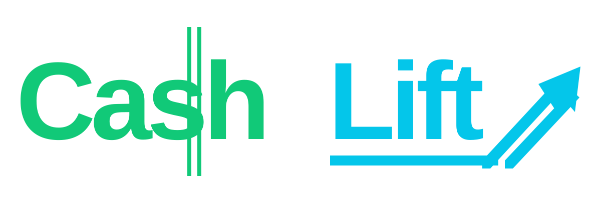
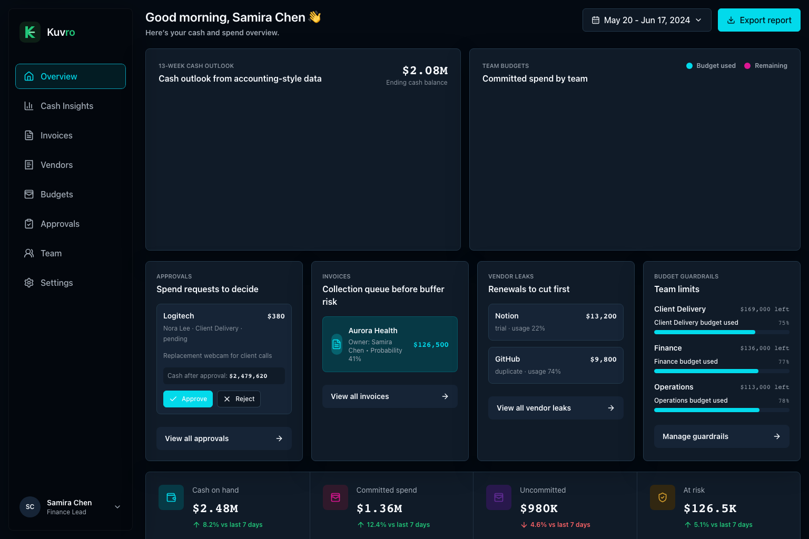

<p align="center">
  
</p>

<h1 align="center">CashLift</h1>

<p align="center">
  Cash decision command center for service firms.
</p>

<p align="center">
  Approve spend. Recover receivables. Protect runway.
</p>

<p align="center">
  <a href="#why-cashlift">Why CashLift</a>
  ·
  <a href="#features">Features</a>
  ·
  <a href="#architecture">Architecture</a>
  ·
  <a href="#getting-started">Getting Started</a>
  ·
  <a href="#security">Security</a>
  ·
  <a href="#roadmap">Roadmap</a>
</p>

<p align="center">
  
  
  
  
  
</p>

---

<p align="center">
  
</p>

---

# Why CashLift

Most finance tools explain what already happened. CashLift helps service firms decide what to do before cash gets tight.

CashLift turns invoices, vendor renewals, spend requests, team budgets, and cash forecasts into one daily operating view. Finance leads can see which collections protect runway, which renewals should be cut, and which spend requests can be approved without breaking the buffer.

Built for agencies, consultancies, studios, and software service firms that need to:

- approve spend with cash impact visible
- recover receivables before buffer risk appears
- find unused subscriptions and duplicate vendor spend
- keep team budgets inside guardrails
- understand cash runway without spreadsheet work
- give finance, managers, and employees the right workspace views

The business model is a finance operations workspace for service companies: CashLift does not move money. It helps teams make better cash decisions around approvals, collections, vendor leaks, budgets, and runway.

---

# Features

## Workspace Dashboard

- Overview dashboard with cash outlook, team budgets, invoice risk, vendor leaks, guardrails, and KPI summary
- Flat workspace navigation: Overview, Cash Insights, Invoices, Vendors, Budgets, Approvals, Team, Settings
- Demo workspace that runs from a local typed fixture
- Production workspace that loads authenticated company data from Supabase

## Finance Workflows

- Spend approvals with requester, vendor, reason, amount, team, and cash impact
- Invoice collection queue with owner and collection probability
- Vendor leak detection for unused, duplicate, and renewal-risk subscriptions
- Team budget tracking with used and remaining budget
- Cash buffer, payroll, runway, inflow, and outflow context

## Platform

- Next.js App Router application
- Clerk authentication for production workspaces
- Supabase-backed production dataset loading
- Local demo mode without external credentials
- Tailwind CSS design system and local UI primitives
- Vitest, Biome, Fallow, and Playwright-based quality checks

---

# Architecture

CashLift separates public marketing, demo mode, and production workspace behavior.

```text
Public marketing routes
        |
        v
Demo mode
Local typed fixture data
        |
        v
Workspace shell and dashboard UI

Production mode
Clerk authenticated user
        |
        v
Supabase workspace dataset
        |
        v
Workspace shell and dashboard UI
```

## Source Layout

```text
src/app/                Next.js route wrappers, layouts, metadata, API routes
src/modules/dashboard/  Overview dashboard components and view model
src/modules/page-shell/ Workspace shell, sidebar navigation, subpage composition
src/modules/workspace/  Dataset loading, demo fixture, Supabase repository, shared types
src/modules/money/      Money formatting and money value types
src/modules/*           Business modules: invoices, vendors, budgets, approvals, subscriptions
src/ui/                 Generic reusable UI primitives
src/services/           Clerk, Supabase, Sentry, env, i18n, query providers
src/utilities/          Domain-agnostic helpers
src/test/               Test setup and fixtures
supabase/               Schema and RLS policy SQL
e2e/                    Playwright smoke tests
```

## Module Rules

- `src/app/**` stays thin: routing, metadata, auth/layout gates, and composition.
- `src/modules/*` owns business and product behavior.
- `src/ui/**` contains generic reusable UI primitives.
- `src/services/**` contains technical integrations.
- `src/utilities/**` contains domain-agnostic helpers.
- Business modules should not import other business modules by default; compose through routes or explicit shell/dashboard composition.

---

# Getting Started

This repo uses pnpm.

```bash
pnpm install
pnpm dev
```

Open:

```text
http://localhost:3000
```

The configured pnpm version requires Node 22.13 or newer.

## Demo Mode

Local development defaults to demo mode.

```bash
CASHLIFT_APP_MODE=demo pnpm dev
```

Demo mode:

- does not require Clerk keys
- does not require Supabase keys
- uses `src/modules/workspace/demoDataset.ts`
- serves the product workspace at `/app`

## Production Mode

Production mode requires Clerk and Supabase configuration.

```env
CASHLIFT_APP_MODE=production
NEXT_PUBLIC_CLERK_PUBLISHABLE_KEY=
CLERK_SECRET_KEY=
NEXT_PUBLIC_SUPABASE_URL=
NEXT_PUBLIC_SUPABASE_PUBLISHABLE_KEY=
```

Production mode:

- requires an authenticated Clerk user
- requests a Supabase JWT from Clerk
- loads the user’s company dataset from Supabase
- fails closed when required environment variables are missing

---

# Quality Checks

```bash
pnpm lint
pnpm typecheck
pnpm test
pnpm fallow
pnpm test:e2e
```

Install Playwright browsers once:

```bash
pnpm test:e2e:install
```

---

# Security

CashLift follows a fail-closed production model.

- Demo mode uses local fixture data and requires no secrets.
- Production mode requires Clerk authentication.
- Supabase JWTs scope production data access.
- Supabase RLS policies enforce company-level isolation.
- Secrets must stay in environment variables.
- No service role keys or database passwords should be exposed to the browser.

---

# Roadmap

## Platform

- [ ] Multi-workspace support
- [ ] Audit timelines
- [ ] Approval escalation chains
- [ ] Role-based permissions
- [ ] Activity feeds

## Finance Intelligence

- [ ] Cash forecasting engine
- [ ] Vendor exposure analytics
- [ ] Aging receivable automation
- [ ] Payment anomaly detection
- [ ] Liquidity trend analysis

## Integrations

- [ ] Slack approvals
- [ ] QuickBooks sync
- [ ] Stripe reconciliation
- [ ] Banking integrations
- [ ] Webhook platform

---

# License

MIT
